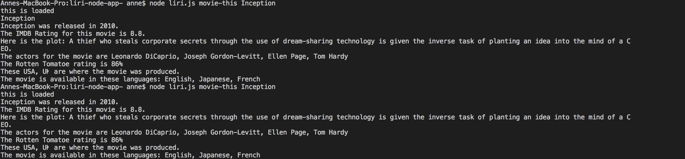
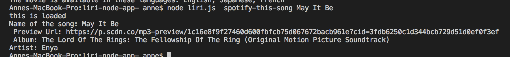
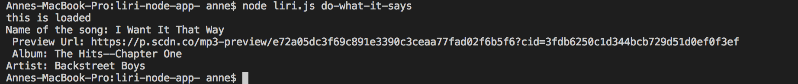

# liri-node-app-

## Summary

Liri Node App is a useful app because users can find info on any movie or song.
The Liri Node App has three functions: movie, spotifyThis, and doWhatItSays.  
The users can use the command: node liri.js movie-this 'movie name here' to call the movie function.
Then the movie function provides the following output information on the film: title, year, IMDB Rating,
Rotten Tomatoes Rating, plot, and actors. Node liri.js spotify-this-song 'song name' calls the spotifyThis
function which results in providing the following output information for that song: artist, song name,
a Spotify song preview link, and album. Node liri.js do-what-it-says, reads random.txt command and the doWhatItSays
function executes the command, depending if it is movie-this 'movie name' or spotify-this-song 'song name'.  
If no song or movie is inputted, the song is defaulted to 'The Sign' by Ace of Base while the movie is defaulted to
'Mr.Nobody'.

## To Get Started

Users can start by going to the liri.js and go to the terminal for liri.js. Then users input the command that they want, described above in the summary: node liri.js movie-this 'movie name', node liri.js spotify-this-song 'song name', or node liri.js do-what-it-says.
The video link below shows how to use the liri.js. Screenshots are also provided below for further use.

## URL

The following link is a video demonstrating how to use liri.js.
https://drive.google.com/file/d/1EiPkUoMHCPG6YpIH569roywWaBjj8JDZ/view?usp=sharing

## Screenshots

Screenshots are provided below for explanation of the use of the liri-node-app.
Example of how to use movie-this command

Example of how to use spotify-this-song command

Example of how to use do-what-it-says command

## More Info On Liri-Node-App

This app is updated and maintaned by the Github user ac5599656. If you have further questions, you can email
ac5599656@gmail.com

## Technology Used

JavaScript/Node/Node-Spotify-API/Axios/DotEnv/fs Node Packaging/
